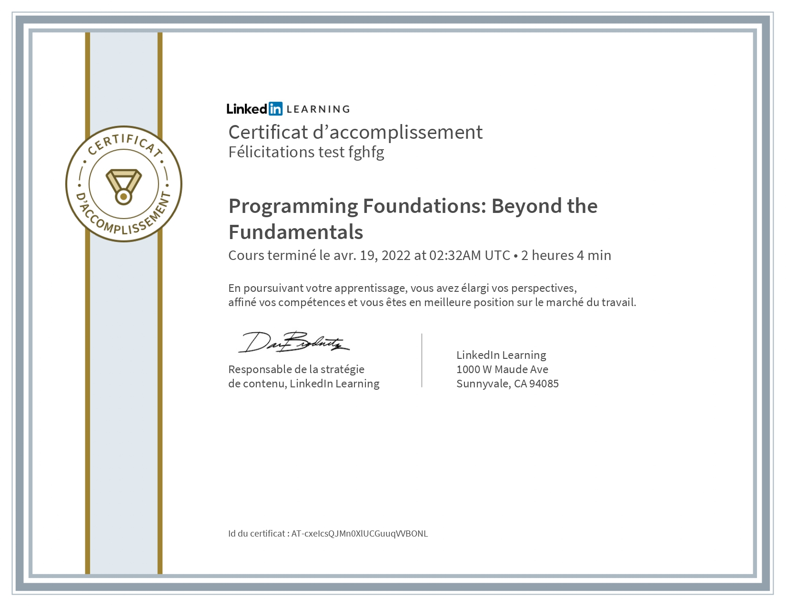
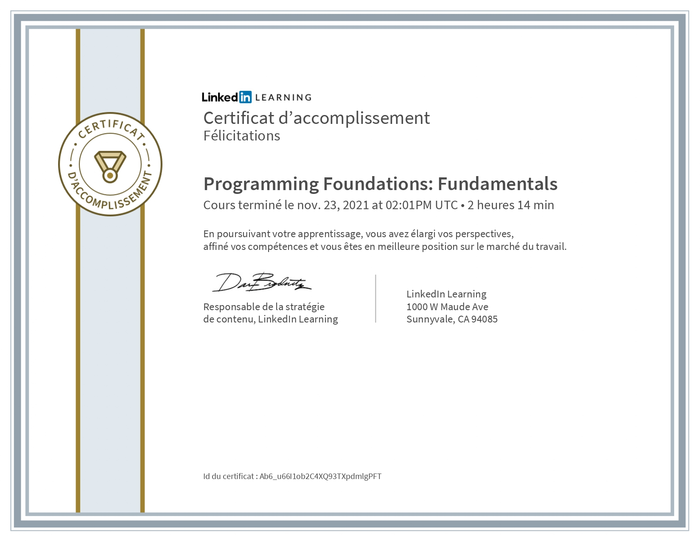
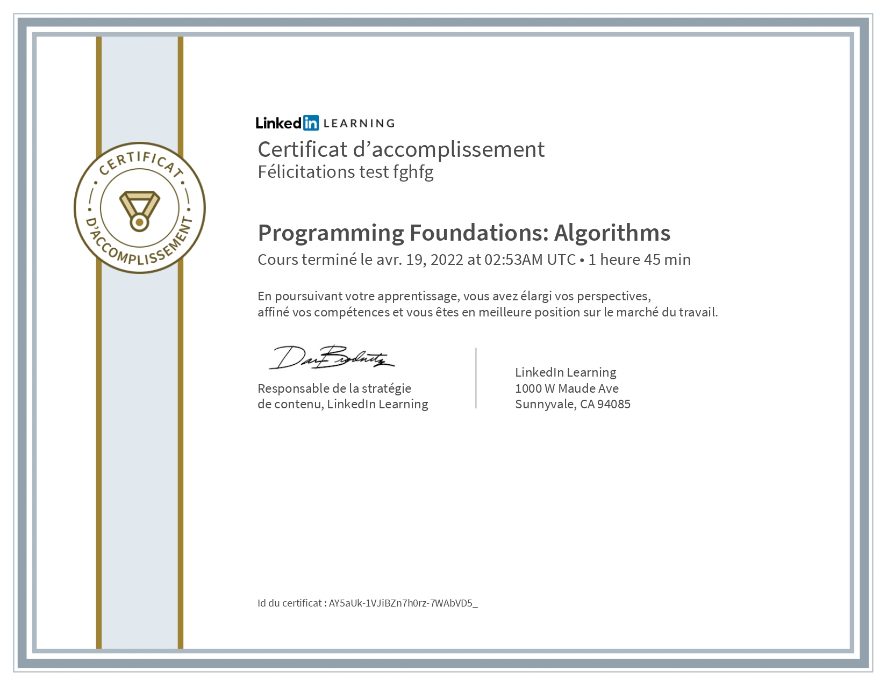
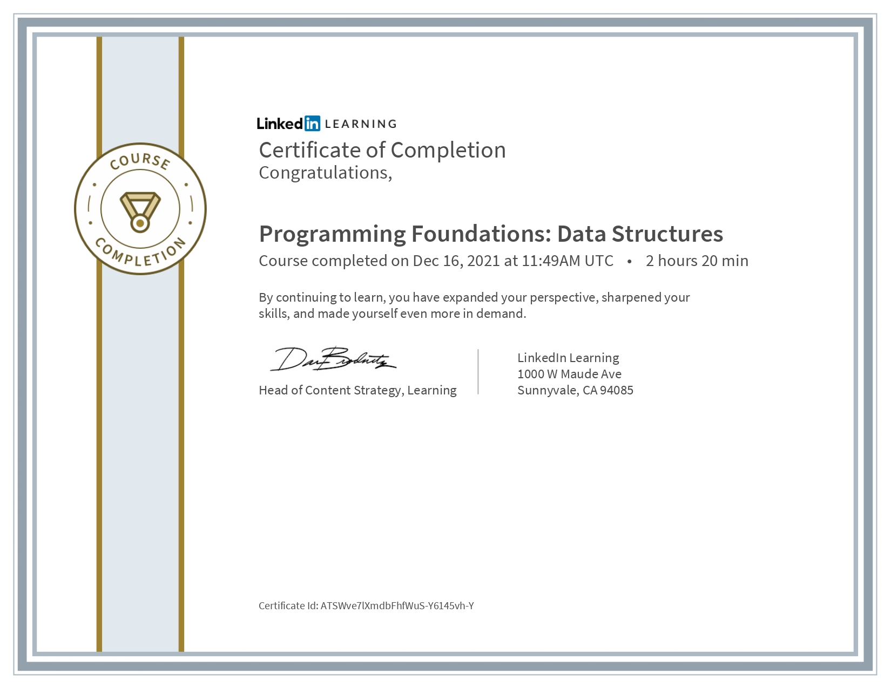
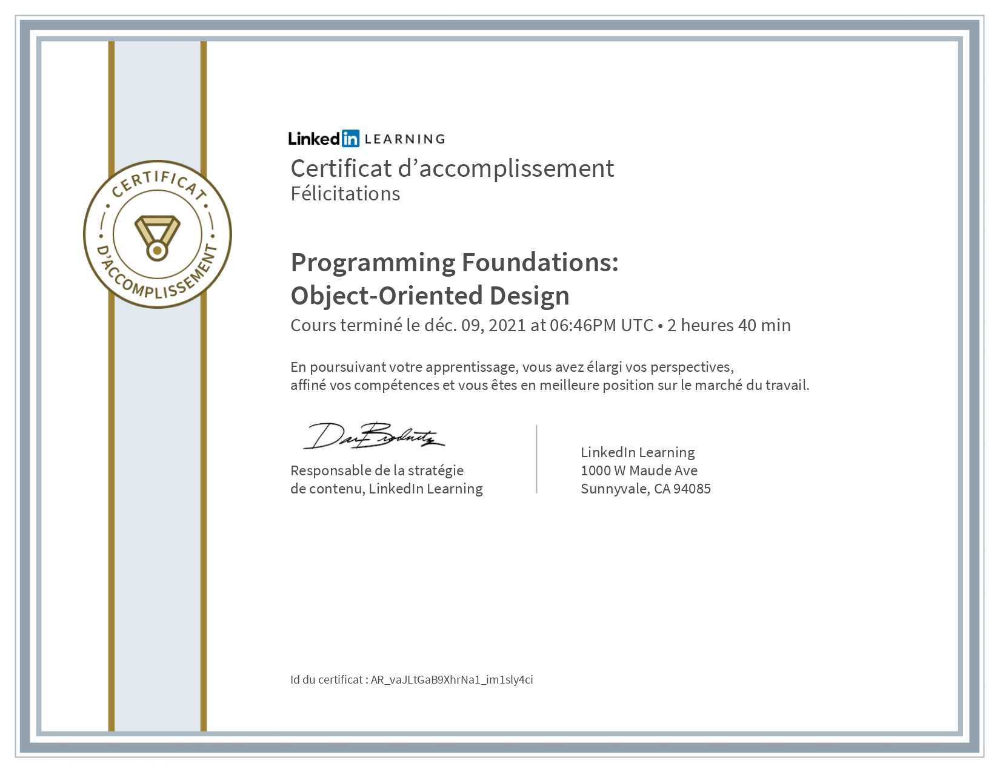
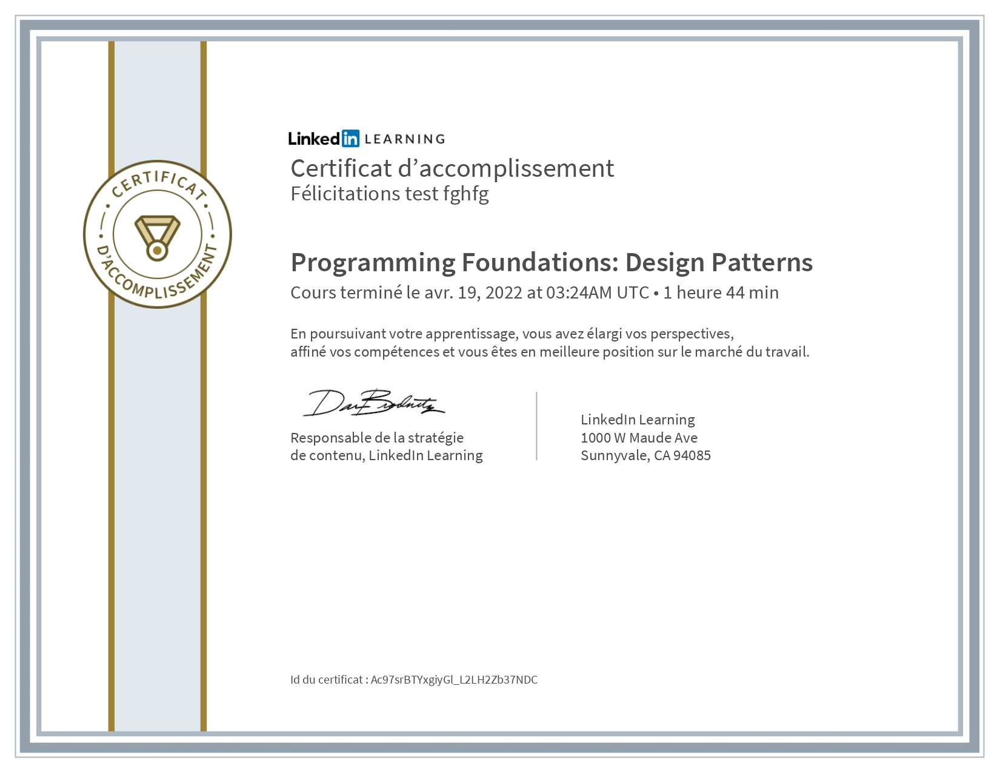
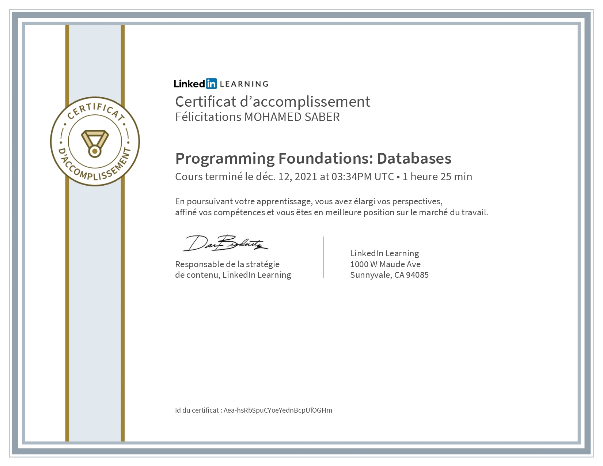

## <a href="https://github.com/SABER-MOHAMED/Kalbonyan-Elmarsos/tree/master/01-Linkedin-Learning" target="_blank">Beyond the Fundamentals</a>

--
##<a href="https://github.com/SABER-MOHAMED/Kalbonyan-Elmarsos/tree/master/01-Linkedin-Learning" target="_blank">Programming Fundamentals</a>

--
##<a href="https://github.com/SABER-MOHAMED/Kalbonyan-Elmarsos/tree/master/01-Linkedin-Learning" target="_blank">Algorithms</a>

--
##<a href="https://github.com/SABER-MOHAMED/Kalbonyan-Elmarsos/tree/master/01-Linkedin-Learning" target="_blank">Data Structures</a>

--
##<a href="https://github.com/SABER-MOHAMED/Kalbonyan-Elmarsos/tree/master/01-Linkedin-Learning" target="_blank">Algorithms</a>

--
##<a href="https://github.com/SABER-MOHAMED/Kalbonyan-Elmarsos/tree/master/01-Linkedin-Learning" target="_blank">Object Oriented Design</a>

--
##<a href="https://github.com/SABER-MOHAMED/Kalbonyan-Elmarsos/tree/master/01-Linkedin-Learning" target="_blank">Design Patterns</a>

--
##<a href="https://github.com/SABER-MOHAMED/Kalbonyan-Elmarsos/tree/master/01-Linkedin-Learning" target="_blank">Databases</a>

--
##<a href="https://github.com/SABER-MOHAMED/Kalbonyan-Elmarsos/tree/master/01-Linkedin-Learning" target="_blank">Software TestingQA</a>

--
##<a href="https://github.com/SABER-MOHAMED/Kalbonyan-Elmarsos/tree/master/01-Linkedin-Learning" target="_blank">Git</a>

