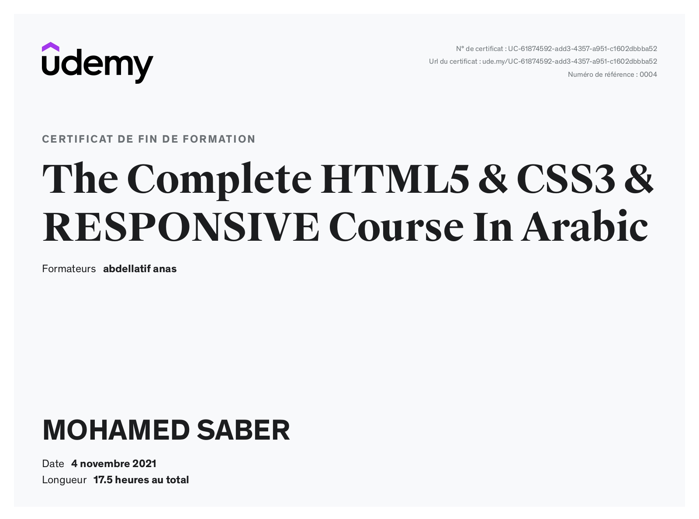

##<a href="https://github.com/SABER-MOHAMED/Kalbonyan-Elmarsos/blob/master/02-Udemy/-01-HTML-CSS-Jonas" target="_blank">Build Responsive Real-World Websites with HTML and CSS</a>

--
##<a href="">The Complete HTML5 & CSS3 & RESPONSIVE Course In Arabic</a>

--
##<a href="https://github.com/SABER-MOHAMED/Kalbonyan-Elmarsos/tree/master/02-Udemy/-02-Js-Jonas" target="_blank">The Complete JavaScript Course 2022: From Zero to Expert!</a>
